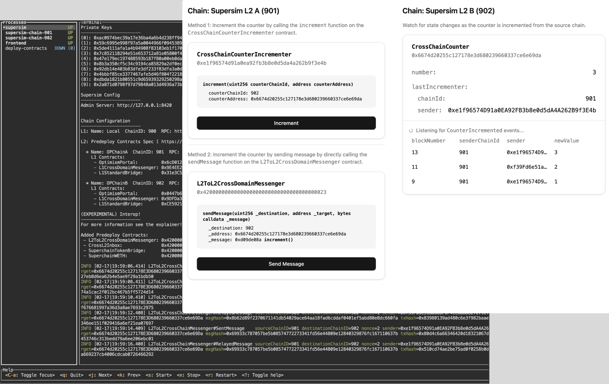

# 🚀 Route101 - Superchain Starter Kit

<div align="center">



**⚡ Lightning-fast Superchain development with cross-chain capabilities**

[](./LICENSE)
[](https://github.com/foundry-rs/foundry)
[](https://reactjs.org/)
[](https://www.typescriptlang.org/)

</div>

## ✨ What's Inside

This starter kit provides everything you need to build cross-chain applications on the Superchain:

### 🔧 **Development Stack**
- **[Foundry](https://github.com/foundry-rs/foundry)** - Blazing fast smart contract development
- **[Supersim](https://github.com/ethereum-optimism/supersim)** - Local Superchain test environment
- **[Super CLI](https://github.com/ethereum-optimism/super-cli)** - Deploy across multiple chains effortlessly

### 🌐 **Frontend Magic**
- **React 18** + **TypeScript** for type-safe development
- **Vite** for lightning-fast builds
- **Tailwind CSS** + **shadcn/ui** for beautiful components
- **Wagmi** + **Viem** for Ethereum interactions

### ⛓️ **Superchain Integration**
- **[@eth-optimism/viem](https://github.com/ethereum-optimism/ecosystem/tree/main/packages/viem)** - Optimized viem for Superchain
- **[@eth-optimism/wagmi](https://github.com/ethereum-optimism/ecosystem/tree/main/packages/wagmi)** - Wagmi extensions for Superchain
- **Cross-chain messaging** ready to go

### 🎯 **Example App**
- **CrossChainCounter** - Learn cross-chain interactions with a simple counter

---

## ⚡ Quick Start

**Get building in under 60 seconds!** 🎯

### 📋 Prerequisites

Make sure you have these installed:
- **Foundry** - [Installation guide](https://book.getfoundry.sh/getting-started/installation)
- **Node.js** (v18 or later)
- **pnpm** (recommended package manager)

### 🏗️ Setup & Run

1. **Clone & Install**
   ```bash
   git clone <your-repository-url>
   cd Route101
   pnpm install
   ```

2. **Start Development**
   ```bash
   pnpm dev
   ```
   
   This single command will:
   - 🚀 Start local Superchain network (1 L1 + 2 L2 chains)
   - 🌐 Launch frontend at [http://localhost:5173](http://localhost:5173)
   - 📦 Deploy smart contracts automatically
   - 🎯 Ready to build!

---

## 🚀 Deployment Made Easy

Deploy your contracts across multiple chains with zero friction using `super-cli`:

### 🎮 Interactive Mode (Recommended)

```bash
pnpm sup
```

Follow the wizard to deploy with ease:
- Select your contract
- Choose target chains
- Configure constructor args
- Deploy with gasless transactions

### ⚡ Non-Interactive Mode

```bash
pnpm sup deploy create2 \
  --chains supersiml2a,supersiml2b \
  --salt ethers phoenix \
  --forge-artifact-path contracts/out/CrossChainCounter.sol/CrossChainCounter.json \
  --network supersim \
  --private-key YOUR_PRIVATE_KEY_HERE
```

### 🔧 Build Before Deploy

Always build your contracts first:
```bash
pnpm build:contracts
```

---

## 🏗️ Project Structure

```
Route101/
├── 📁 contracts/              # Smart contracts (Foundry)
│   ├── src/                   # Contract source code
│   ├── test/                  # Contract tests
│   └── script/                # Deployment scripts
├── 📁 src/                    # Frontend application
│   ├── components/            # React components
│   ├── abi/                   # Contract ABIs
│   └── App.tsx               # Main app component
├── 📁 public/                 # Static assets
└── 📁 supersim-logs/         # Local network logs
```

---

## 🎯 Example: CrossChainCounter

### What it does
- **Simple cross-chain counter** - Learn Superchain Interop basics
- **Cross-chain only increments** - Unlike single-chain counters, this one requires cross-chain messages
- **Perfect learning tool** - Understand cross-domain messaging patterns

### How it works
1. Deploy on multiple chains
2. Increment counter from one chain
3. Watch it update on another chain
4. Learn the magic of Superchain Interop!

---

## 🛠️ Available Scripts

| Command | Description |
|---------|-------------|
| `pnpm dev` | Start full development environment |
| `pnpm dev:frontend` | Frontend only |
| `pnpm dev:supersim` | Local Superchain network only |
| `pnpm build:frontend` | Build frontend for production |
| `pnpm build:contracts` | Compile smart contracts |
| `pnpm typecheck` | Run TypeScript checks |
| `pnpm lint` | Run ESLint |
| `pnpm format` | Format code with Prettier |

---

## 🌟 Why This Stack?

### ⚡ **Performance**
- **Foundry** - Fastest Solidity development experience
- **Vite** - Instant hot reload for frontend
- **Supersim** - Local testing without mainnet costs

### 🔒 **Security**
- **TypeScript** everywhere for type safety
- **Modern tooling** with best practices
- **Gasless deployments** for testing

### 🚀 **Developer Experience**
- **One command setup** - `pnpm dev` does everything
- **Interactive deployment** - No complex CLI arguments
- **Hot reload** - See changes instantly

---

## 🎓 Learning Resources

### 📚 **Documentation**
- [Superchain Interop Tutorials](https://docs.optimism.io/app-developers/tutorials/interop)
- [Superchain Dev Console](https://console.optimism.io/)
- [Error Signatures Guide](https://github.com/ethereum-optimism/ecosystem/blob/main/packages/viem/docs/abi-signatures.md)

### 🔍 **Common Errors**
- `TargetCallFailed()`: `0xeda86850`
- `MessageAlreadyRelayed`: `0x9ca9480b`
- `Unauthorized()`: `0x82b42900`

---

## 🎨 More Examples

Want to see more complex patterns? Check out these examples:

| Example | What You'll Learn |
|---------|-------------------|
| ⚡ [Crosschain Flash Loan](https://github.com/ethereum-optimism/superchain-starter-xchain-flash-loan-example) | Dependent cross-chain messages, TokenBridge usage |
| 💸 [Multisend](https://github.com/ethereum-optimism/superchain-starter-multisend) | Cross-chain callbacks, WETH transfers |
| 🪙 [SuperchainERC20](https://github.com/ethereum-optimism/superchain-starter-superchainerc20) | ERC-7802 interface, deterministic deployments |
| 🏓 [CrossChainPingPong](https://docs.optimism.io/app-developers/tutorials/interop/contract-calls) | State passing between chains |
| 🕹️ [CrossChainTicTacToe](https://docs.optimism.io/app-developers/tutorials/interop/event-reads) | Event-based cross-chain apps |

---

## 🏢 Production Considerations

While this structure is perfect for prototyping, production apps often separate concerns:

**Examples:**
- **Uniswap**: [Contracts](https://github.com/Uniswap/v4-core) | [Frontend](https://github.com/Uniswap/interface)
- **Across**: [Contracts](https://github.com/across-protocol/contracts) | [Frontend](https://github.com/across-protocol/frontend)
- **Farcaster**: [Contracts](https://github.com/farcasterxyz/contracts)

---

## 📄 License

This project is licensed under the [MIT License](./LICENSE).

<div align="center">

---

**Built with ❤️ for the Superchain ecosystem**

[](./LICENSE)

</div>